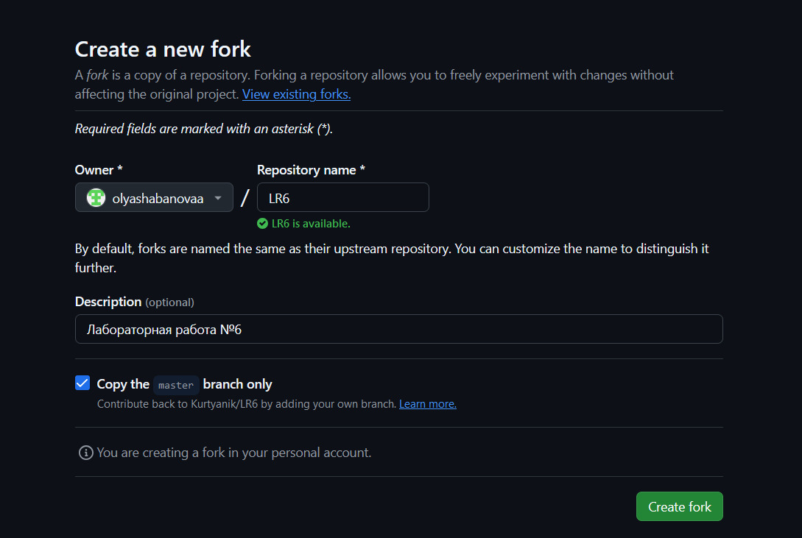
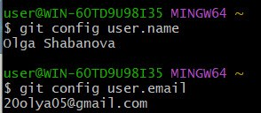
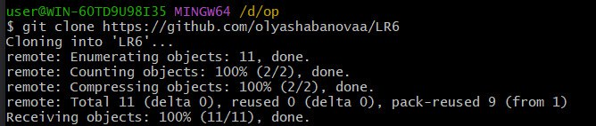
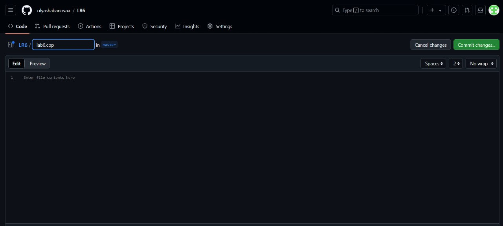
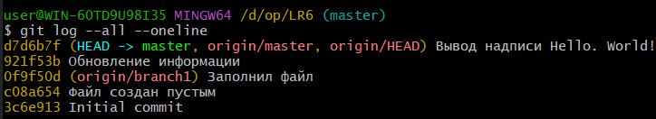
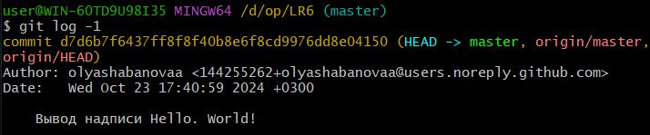
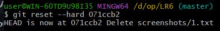

# LR6
Лабораторная работа №6

# Отчёт по работе с Git

## 1. Создание копии в личное хранилище 
*Скриншот с созданием форка*  




## 2. Проверка имени пользователя и его электронной почты
*Скриншот с проверкой*




## 3. Клонирование репозитория
*Скриншот с командой для клонирования*




## 4. Добавление нового файла через интерфейс GitHub


## 5. Добавление изменений в репозиторий
```bash
$ git pull
```

## 6. Получение истории операций для веток
*Команда для получения истории операций*


```bash
$ git log --all --oneline
```
*Результат работы команды*




## 7. Просмотр последних изменений
*Команда для просмотра последних изменений*


```bash
$ git log -1
```
Результат работы команды




## 8. Слияние веток и решение конфликта
*Для того, чтобы выполнить слияние веток, необходимо сначала перейти в ветку master с помощью команды:*


```bash
$ git checkout master
```
*Далее можно выполнить слияние, используя команду:*


```bash
$ git merge branch1
```


*Конфликт был устранён с помощью удаления ненужного содержимого в текстовом файле mergefile.txt в ветке branch1*


## 9. Удаление побочной ветки после слияния
```bash
$ git branch -d branch1
```

## 10. Откат коммита
*Для начала необходимо посмотреть историю операций с помощью команды:*


```bash
$ git log --all --oneline
```
*Далее использовать другую команду*


```bash
$ git reset --hard 071ccb2
```

*Скриншот с результатом предыдущей команды*




## 11. Создание новой ветки для отчета
```bash
$ git checkout -b rep
```

## 12. Получение истории операций в форматированном виде
```bash
$ git log --pretty=format: "%h %ad %an %s" --date=short
```

## 13. Финальная история операций
+ 281bfd0 2024-10-23 Olga Shabanova Разрешение конфликта с помощью изменения файла mergefile.txt
+ d7d6b7f 2024-10-23 olyashabanovaa Вывод надписи Hello. World!
+ 921f53b 2020-11-21 Kurtyanik Обновление информации
+ 0f9f50d 2020-11-21 Kurtyanik Заполнил файл
+ c08a654 2020-11-21 Kurtyanik Файл создан пустым
+ 3c6e913 2020-11-21 Kurtyanik Initial commit


